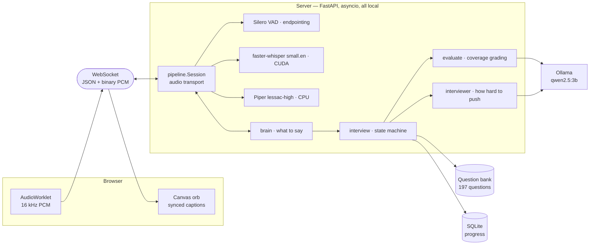

# Interview Coach

A voice-driven technical interview simulator that runs entirely on one laptop —
no API keys, no cloud, no data leaving the machine. You speak, it listens, grades
what you actually said against a rubric, tells you what you missed, and decides
how hard to push next.

Built to run inside **4 GB of VRAM** on a GTX 1650 Ti — speech recognition, a
language model, speech synthesis and voice activity detection all loaded at
once — with a **510 ms** median response time.

<!-- Add a screenshot at docs/screenshot.png, then delete this comment and
     uncomment the line below.

-->

---

## The interesting problem

A spoken interview is a real-time system with a hard perceptual deadline. Past
roughly 1.5 seconds of silence after you stop talking, a conversation stops
feeling like a conversation. That budget has to cover four sequential stages:

```
speech ends → transcribe → grade → generate reply → synthesize audio → sound
```

The first honest measurement came in at **3150 ms** — more than double the
budget, on hardware that could not simply be upgraded. Getting to 510 ms was the
actual engineering work in this project, and none of it came from a faster model.

| | Endpoint → first audio |
|---|---|
| Naive sequential pipeline (Phase 0, measured) | 3150 ms |
| **Current** | **510 ms** |

### How, in three moves

Every one of them is the same idea: **start the audio on something you already
know, and compute the expensive thing behind it.**

**1. Transcribe during the silence, not after it.** The endpointer waits 1300 ms
of silence before declaring the answer finished — a long threshold on purpose,
because interview answers contain thinking pauses and being cut off mid-thought
is worse than any latency. But that 1300 ms is dead time. Transcription now
starts the moment speech *stops*, speculatively, and is discarded if the
candidate resumes. Everything added afterwards was silence, so the speculative
result is still valid. **Whisper's cost became invisible** — 0 ms of it lands
after the endpoint on answers under ~25 seconds.

**2. Speak a short first phrase while the rest is still being written.** Piper
synthesizes a whole string before emitting any audio, so time-to-first-sound is
proportional to the text handed over. A 7-word opening phrase cost 1071 ms. But
a one-word opener is a trap — each following phrase can only grow so much before
playback underruns and you hear a gap. At Piper's measured 3.6x realtime the
safe growth is 3.6x per span, so the chunker opens at 3–6 words and ramps at 3.0x
for margin.

**3. Say "okay, got it" while grading runs.** Grading costs ~2 s and *nothing*
can be said until it finishes, because the verdict determines every following
word. Real interviewers don't sit in silence while they think — they
acknowledge. Grading now runs as a concurrent task with a rotating
acknowledgement spoken over the top of it. This alone took the turn from
~2500 ms to ~685 ms.

---

## Architecture



The layering is deliberate: `pipeline.Session` owns *audio* and knows nothing
about interviews; a "brain" owns *what to say* and knows nothing about Piper.
That seam is why the plain-conversation smoke test and the real interview share
one audio path.

---

## Design decisions worth defending

**A 3B model is used for judgement, never for facts or structure.** Bank
questions are read verbatim and never reworded — a small model paraphrasing a
question silently invalidates the reference answer and the expected points that
grading depends on. The interview's structure is arithmetic. The model gets the
two jobs it is genuinely good at: deciding whether an answer covered a specific
point, and writing one short spoken transition.

**Grading is coverage, not a holistic verdict.** Every question carries four
expected points. The model answers one entailment-shaped question per point —
*did they state this?* — and the **code** computes the score and verdict
arithmetically from the ratio. This is what makes a 3B usable as a grader, and
it is also why the report can tell you precisely which points you missed rather
than a vague grade. Ranking accuracy: **10/10** fixtures across all three modes.

**One grader would have been wrong.** "What is a deadlock" has a correct answer.
"Tell me about a conflict with a teammate" does not, and grading the second as
if it were the first produces feedback worse than none. Questions declare a mode
— `FACTUAL`, `BEHAVIOURAL`, `OPEN_ENDED` — and the evaluator dispatches on it,
using a different task verb for each (*stated* / *satisfies* / *raised*).
Getting that verb right took behavioural grading from 0/4 to 3/3.

**The interview reads the run, not the last answer.** Difficulty adaptation
originally moved on each verdict, which made the level oscillate and read as an
interviewer with no memory. It now looks at streaks and a running mean. A single
stumble inside a strong run doesn't collapse the level; one lucky answer after
several weak ones doesn't earn a hard question. A flawless candidate on a plan
of `1,1,2,2,3,3,4,4` actually gets asked `1,1,3,4,5,5,5,5`.

**Every model call has a non-model fallback.** A failed grade falls back to
keyword overlap. A failed difficulty decision falls back to an arithmetic rule.
A failed turn reports and continues. The interview never ends because a model
misbehaved.

**Captions ride the audio clock.** Text is revealed phrase-by-phrase at the
moment each audio buffer starts playing, scheduled on the same `playhead`
arithmetic that keeps Piper chunks gapless — not when the message arrives, which
put the words on screen seconds ahead of the voice.

---

## Measured behaviour

Hardware: Intel i5-10300H, GTX 1650 Ti 4 GB (Turing), 16 GB RAM, Windows 11.

| | |
|---|---|
| Endpoint → first audio | **510 ms** median (budget 1500 ms) |
| Peak VRAM, device-wide, everything loaded | **2631 MiB / 4096** |
| STT cost visible to the user | **0 ms** on answers under ~25 s |
| Grader ranking accuracy | **10/10** fixtures, all three modes |
| Question bank | 197 across 7 topics |

---

## Stack

| Layer | Choice | Why |
|---|---|---|
| STT | faster-whisper `small.en`, int8_float16, CUDA | CTranslate2; int8 weights halve VRAM, fp16 compute keeps the encoder fast on Turing |
| LLM | Ollama · `qwen2.5:3b` Q4_K_M | Fits alongside the others; prompt-prefix caching exploited by putting static instructions first |
| TTS | Piper `en_US-lessac-high`, CPU | 3.6x realtime on CPU, leaving the GPU entirely to STT and the LLM |
| VAD | Silero, CPU | 1300 ms endpoint threshold — tuned long, because being cut off mid-thought is worse than latency |
| Server | FastAPI + WebSocket, asyncio | One socket carries JSON events and binary PCM both ways |
| Frontend | Vanilla JS + Canvas, no build step | ~870 lines for the app; no toolchain in a Python project |
| Storage | SQLite | Two tables, no ORM, no migration framework |

---

## Running it

Requires Python 3.11/3.12, [uv](https://docs.astral.sh/uv/), and
[Ollama](https://ollama.com/).

```powershell
uv sync
ollama pull qwen2.5:3b

# The Piper voice is 113 MB and not in the repo — fetch it into data/voices/
# from https://huggingface.co/rhasspy/piper-voices (en_US-lessac-high)

.venv\Scripts\python.exe -m coach.server
```

Then open `http://127.0.0.1:8000`, or `/debug` for a live per-stage latency
panel. The startup line should read `stt=cuda/int8_float16` — `stt=cpu` means
the GPU wasn't picked up and everything will be slower.

---

## Tests

There is no framework here. Each phase has a harness that drives the real code
and asserts the property that phase existed to deliver — including the ones that
are latency and quality rather than correctness.

```powershell
.venv\Scripts\python.exe bench\phase3_eval_test.py      # grading accuracy
.venv\Scripts\python.exe bench\phase5_e2e_test.py       # full spoken interview
.venv\Scripts\python.exe bench\phase8_adaptive_test.py  # bank shape + adaptation
node bench\ui_smoke.mjs                                 # frontend, no browser
```

`phase5_e2e_test.py` synthesizes answers with Piper and streams them into the
socket at realtime pace, so the VAD, endpointer, and speculative STT are all
exercised for real rather than stubbed.

`ui_smoke.mjs` exists because a mis-ordered `let` once threw a
`ReferenceError` during module evaluation and took out the entire frontend —
and both `node --check` and a static element-reference scan passed. It runs the
page's real module against a stub DOM and a **fake audio clock**, which makes
caption timing assertable: a phrase must *not* be on screen before its audio
starts, and must be when it does.

---

## Honest limitations

- **Latency and accuracy figures come from Piper-synthesized speech** — no
  accent, no room noise, no filler words. Two constants (the 1300 ms endpoint
  threshold and the transcript confidence gate) remain untuned against a real
  voice.
- **Only the Python bank is hand-written.** Its 66 questions were authored
  directly after the generated ones proved unusable — a 3B asked for "a question
  about closures" writes a 40-word two-part exam question, not something a
  person says out loud. The other six topics still carry generated questions
  with that flaw.
- **No barge-in.** Microphone input is dropped while the coach speaks, so it
  cannot transcribe its own voice. Deliberate, and the reason "can you repeat
  the question?" doesn't work.
- **Single user, single session.** No auth, no concurrency, binds to localhost.
  It is a personal tool and is built like one.

---

## Repository

```
src/coach/        pipeline, brains, interview state machine, grading, adaptation
scripts/          question bank builders (one generated, one hand-written)
bench/            per-phase verification harnesses
web/              single-page frontend, no build step
data/bank/        the question bank, committed as content
```

A full engineering log — every phase, every measurement, and every problem hit
along the way, including the ones that were my own mistakes — is kept in
`logs.md`.

---

Built as a personal interview-preparation tool, and as an exercise in making
small models and modest hardware behave like something much larger.
